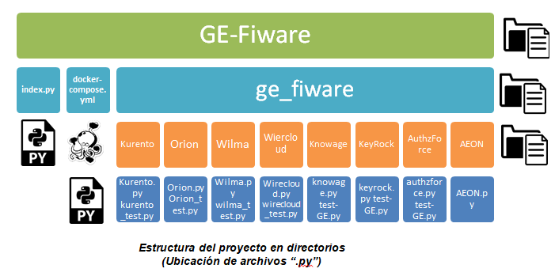

GE-Fiware
=========
Este manual tiene como finalidad ayudar a los usuarios interesado en utilizar los scripts ofrecidos en https://github.com/blackbearst/GE-Fiware los cuales han sido diseñados para la automatización y despliegue de los siguientes GE de FIWARE:
-	Kurento
-	Orion
-	Wirecloud
-	Wilma pep proxy
-	Knowage
-	KeyRock
-	AuthzForce
-	AEON
## Requerimientos de software para la utilización de Aut-GE-FIWARE:
-	Sistema operativo: cualquier distribución de Linux de 64 bits, se recomienda (Ubuntu 16 o versiones posteriores).
-	Docker (necesario agregar su usuario al grupo de acopladores para evitar el uso de sudo junto con los comandos docker).
-	Python.
## Implementación:
En la siguiente figura se  muestra la estructura de los archivos incluidos en cada directorio del repositorio de Github.

  

Para ejecutar Aut-GE-FIWARE es necesario abrir una nueva terminal de comandos. 
Los scripts están adaptados para evitar el uso de sudo por lo cual es necesario agregar su usuario al grupo de acopladores con el siguiente comando:
 <pre>
 $ sudo usermode –aG docker $USER //Remplazar USER por su usario.
 </pre>

En la terminal se ubicara en la ruta en la cual desee guardar el directorio a clonar, introducirá el siguiente comando para clonar el directorio alojado en el repositorio de Github  a su máquina host:
 <pre>
 $ git clone https://github.com/blackbearst/GE-Fiware.git
 </pre>

+ Si ya había clonado el repositorio previamente y desea actualizarlo deberá posicionarse dentro del directorio “GE-Fiware” e ingresar el siguiente comando:
       <pre>
       $ git pull
       </pre>

  

Una vez clonado el directorio “GE-Fiware” para poder hacer uso de Aut-GE-FIWARE, ubicarse dentro del directorio e introducir el siguiente comando:
 <pre>
 python index.py
 </pre>
Con este comando se iniciara el script index.py el cual incluye las instrucciones para ejecutar cada uno de los scripts que automatiza el despliegue de cada uno de los diferentes GE incluidos en mencionado script.

## Edición:
Para comodidad del usuario se puede elegir que GE desee desplegar, bastara con abrir el archivo “index.py” y ubicarse en la siguiente sección:

 <pre>
 os.system('cd ge_fiware/Kurento && python Kurento.py') #run KMS
 os.system('cd ge_fiware/Orion && python Orion.py') #run Orion
 os.system('cd ge_fiware/Wirecloud && python Wirecloud.py') #run Wirecloud
 os.system('cd ge_fiware/Wilma && python Wilma.py') #run Wilma
 os.system('cd ge_fiware/AuthzForce && python authzforce.py') #run AuthzForce
 os.system('cd ge_fiware/KeyRock && python keyrock.py') #run KeyRock
 os.system('cd ge_fiware/Knowage && python knowage.py') #run Knowage
 </pre>
En esta sección como se observa están indicados cada uno de los scripts por separado de cada GE, bastara con comentar la línea de código del GE que no queremos que sea ejecutado poniendo un “#” delante de la línea de código.

## Solución de problemas:
Si una vez iniciado el script “index.py” observa que al desplegar cualquier GE se queda el prompt parpadeando por mucho tiempo sin realizar ninguna acción.

Acceda a su navegador predeterminado e introduzca en la barra de direcciones la siguiente dirección: 
 <pre>
 http://localhost:4444
 </pre>
Esto lo redireccionará a la página de servicios del contenedor de Selenium el cual es utilizado por los GE para su automatización.

