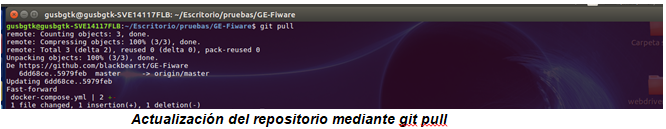
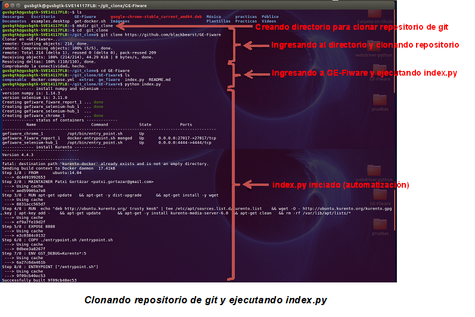
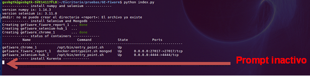
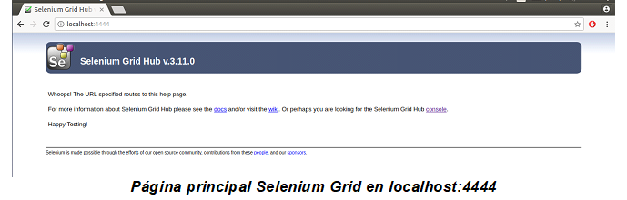
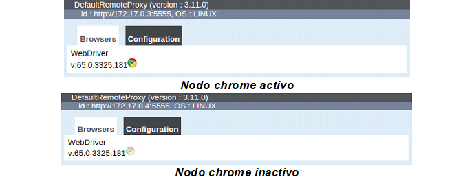
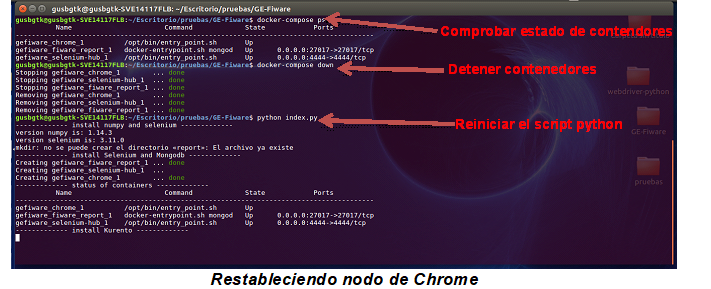
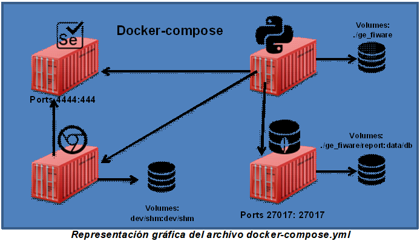

GE-Fiware
=========
Este manual tiene como finalidad ayudar a los usuarios interesado en utilizar los scripts ofrecidos en https://github.com/blackbearst/GE-Fiware los cuales han sido diseñados para la automatización y despliegue de los siguientes GE de FIWARE:
-	Kurento
-	Orion
-	Wirecloud
-	Wilma pep proxy
-	Knowage
-	KeyRock
-	AuthzForce
-	AEON
## Requerimientos de software para la utilización de Aut-GE-FIWARE:
-	Sistema operativo: cualquier distribución de Linux de 64 bits, se recomienda (Ubuntu 16 o versiones posteriores).
-	Docker (necesario agregar su usuario al grupo de acopladores para evitar el uso de sudo junto con los comandos docker).
-	Python.
## Implementación:
En la siguiente figura se  muestra la estructura de los archivos incluidos en cada directorio del repositorio de Github.
<p align="center">
   
</p>
Para ejecutar Aut-GE-FIWARE es necesario abrir una nueva terminal de comandos. 
Los scripts están adaptados para evitar el uso de sudo por lo cual es necesario agregar su usuario al grupo de acopladores con el siguiente comando:
 <pre>
 $ sudo usermode –aG docker $USER //Remplazar USER por su usario.
 </pre>

En la terminal se ubicara en la ruta en la cual desee guardar el directorio a clonar, introducirá el siguiente comando para clonar el directorio alojado en el repositorio de Github  a su máquina host:
 <pre>
 $ git clone https://github.com/blackbearst/GE-Fiware.git
 </pre>

+ Si ya había clonado el repositorio previamente y desea actualizarlo deberá posicionarse dentro del directorio “GE-Fiware” e ingresar el siguiente comando:
       <pre>
       $ git pull
       </pre>
<p align="center">
    
</p>

Una vez clonado el directorio “GE-Fiware” para poder hacer uso de Aut-GE-FIWARE, ubicarse dentro del directorio e introducir el siguiente comando:
 <pre>
 python index.py
 </pre>
Con este comando se iniciara el script index.py el cual incluye las instrucciones para ejecutar cada uno de los scripts que automatiza el despliegue de cada uno de los diferentes GE incluidos en mencionado script.
<p align="center">
    
</p>

## Edición:
Para comodidad del usuario se puede elegir que GE desee desplegar, bastara con abrir el archivo “index.py” y ubicarse en la siguiente sección:

 <pre>
 os.system('cd ge_fiware/Kurento && python Kurento.py') #run KMS
 os.system('cd ge_fiware/Orion && python Orion.py') #run Orion
 os.system('cd ge_fiware/Wirecloud && python Wirecloud.py') #run Wirecloud
 os.system('cd ge_fiware/Wilma && python Wilma.py') #run Wilma
 os.system('cd ge_fiware/AuthzForce && python authzforce.py') #run AuthzForce
 os.system('cd ge_fiware/KeyRock && python keyrock.py') #run KeyRock
 os.system('cd ge_fiware/Knowage && python knowage.py') #run Knowage
 </pre>
En esta sección como se observa están indicados cada uno de los scripts por separado de cada GE, bastara con comentar la línea de código del GE que no queremos que sea ejecutado poniendo un “#” delante de la línea de código.

## Solución de problemas:
Si una vez iniciado el script “index.py” observa que al desplegar cualquier GE se queda el prompt parpadeando por mucho tiempo sin realizar ninguna acción.
<p align="center">
    
</p>
Acceda a su navegador predeterminado e introduzca en la barra de direcciones la siguiente dirección: 
 <pre>
 http://localhost:4444
 </pre>
Esto lo redireccionará a la página de servicios del contenedor de Selenium el cual es utilizado por los GE para su automatización.
<p align="center">
  
</p>

Ingrese a la opción de "console" y compruebe que el icono de chrome se encuentre activo , si se encuentra sombreado significa que el nodo se ha cerrado .
<p align="center">
   
</p>

Para solucionar este problema:
1.	Detenga la ejecución del script en la terminal introduciendo el juego de teclas “control + c”.
2.	En la consola introduzca el siguiente comando:
   <pre>
   $ docker-compose down
   </pre>
Este comando removerá los contenedores incluidos en el docker-compose.
3.	Vuelva a iniciar el script con el comando:
   <pre>
   $ python index.py
   </pre>
<p align="center">
   
</p>

## ¿Que incluye el docker-compose?
El docker-compose.yml está diseñado para levantar tres servicios diferentes por un lado  levanta un contenedor Selenium el cual a su vez se conecta con otro contenedor el cual es un nodo de Chrome, si este nodo de chrome se cierra durante la ejecución del script ocasionara que  el prompt se quede pasmado evitando continuar con la ejecución.
Por último se levanta un tercer servicio el cual es un contenedor con MongDB para guardar los reportes generados por cada una de las pruebas para asegurar la persistencia de los datos.
<p align="center">
   
</p>

## Puertos de contenedores:
docker-compose.yml
-	Selenium puerto: 4444
-	Mongo puerto: 27017
-	Chrome puerto: null

Kurento 
-	Kms puerto: 8888

Orion 
-	Orion pueto: null
-	Mongo puerto: 1026

Wirecloud
-	Ngnix puerto: 80
-	Postgres puerto: 5432
-	Elasticsearch puerto: null
-	Wirecloud puerto: null

Wilma pep proxy
-	Pep-proxy puerto:80

Knowage
-	Knowage puerto: 8080
-	My SQL puerto: null

KeyRock
-	My SQL puerto: 3306
-	Fiware idm puertos: 3000, 443

AuthzForce
-	AuthzForce puerto: 8080

AEON
-	Mongo puerto: 27017
-	Rabbittmq puertos: 5672, 15672
-	Events puerto: 7789
-	Dashboard puerto: 8080
-	Rest puerto: 3000

## Observaciones:
-	Los tiempos de ejecución varían dependiendo el GE y el equipo host sobre el cual se ejecuta el script.
-	Si la conexión a internet es lenta tardara en descargar las imágenes correspondientes de los GE en docker.
-	 La primera corrida tardara más debido a la clonación y descarga de los diferentes repositorios de Github correspondiente a cada GE. 
## Recomendaciones:
-	Contar con una conexión a internet rápida y estable.
-	Contar con las últimas versiones de docker y python.
-	Verificar que los puertos utilizados por los GE no interfieran con algún contendor ya desplegado en su máquina host.

=======
# FIWARE-specific documentation and Docker distribution 
This project is part of [FIWARE](https://www.fiware.org). More info on the [FIWARE catalogue](http://catalogue.fiware.org/enablers/authorization-pdp-authzforce).

This project provides the source of various FIWARE-specific documents and packaging related to AuthzForce Server. AuthzForce Server is FIWARE Authorization PDP GEri (Generic Enabler Reference Implementation):
- Technical specifications of the FIWARE Authorization PDP Generic Enabler (GE)'s API that AuthzForce implements in various forms:
  - WADL and XML schemas (the reference);
  - Apiary blueprint (the HTML output is available in [Apiary style](http://docs.authorizationpdp.apiary.io) and [FIWARE style](http://authzforce.github.io/fiware/) ).
- The source of the GEri's documentation: Installation and Administration guide, User and Programmer Guide, etc. The generated documentation is available for each AuthzForce Server release as standalone HTML/PDF from the [Server release page](https://github.com/authzforce/server/releases), or online on [readthedocs.org](http://readthedocs.org/projects/authzforce-ce-fiware/versions/);
- The source of the GEri's Docker image published in FIWARE Docker hub.

The actual source code of the GEri is in [server component's repository](https://github.com/authzforce/server).

# How to generate the documentation
Checkout this git repository, go to the `doc` directory of the local copy, then
for HTML output, run: 

 ```shell
 make clean html
 ```

For PDF output, if you do it for the first time, install the requirements (instructions for Ubuntu 14.04+):
 ```shell
 sudo aptitude install texlive-latex-recommended texlive-fonts-recommended texlive-latex-extra
 ```
Then run:

```shell
make clean latexpdf
```

# Release

In order to make a release for a new AuthzForce server version, do as follows:

1. Update `version` and `release` variables in [Sphinx configuration](doc/conf.py), to match the new AuthzForce server version.
1. Update manuals: [Installation and Administration Guide](doc/InstallationAndAdministrationGuide.rst) and [User and Programmer's Guide](doc/UserAndProgrammersGuide.rst); especially version numbers when they occur.
1. Update the [Dockerfile](docker/Dockerfile) with the new link to the .deb package on Maven central.
1. Update FILAB deployment scripts: [install.sh](filab.deploy/install.sh), [verif.sh](filab.deploy/verif.sh); especially the package version to match the new AuthzForce server version.
1. Update the [changelog](CHANGELOG.md) with the new version.
1. Commit and push all changes
1. Test the Dockerfile by triggering Docker build with tag name *latest-unstable* (from git branch *master*) on [authzforce-ce-server's Docker repository](https://hub.docker.com/r/fiware/authzforce-ce-server/) (*Build Settings*). Check the result in *Build Details*.
1. After Docker build is OK, test the readthedocs.org HTML/PDF output by building the version *latest* from the [readthedocs.org repository](https://readthedocs.org/projects/authzforce-ce-fiware/builds/).
1. After the readthedocs.org build is OK, create a release on Github with same tag name as the matching release of the AuthzForce [server](https://github.com/authzforce/server/releases/latest), e.g. `release-1.2.3`.
1. Create a Docker tag in [build settings of authzforce-ce-server's Docker repository](https://hub.docker.com/r/fiware/authzforce-ce-server/) with the new release tag as *Name*, e.g. `release-1.2.3`, save changes and trigger the build.
1. Trigger readthedocs.org to fetch the new release tag by updating something in the [authzforce-ce-fiware project Settings in Admin menu](https://readthedocs.org/dashboard/authzforce-ce-fiware/edit/) such as the *Description*. 
1. In the *Versions* sub-menu of *Admin* on this readthedocs.org repository, you should now see the new tag/version. Check the *Active* checkbox next to it and click *Submit*.
1. In the *Builds* menu on the readthedocs.org repository, select the new version and click the *Build version:* button. The build is triggered and added to the queue. Wait until the status changes to *Passed*. 


# Hotfix
If you need to fix things on a release, create a hotfix release by adding/incrementing a letter as suffix to the AuthzForce server version, e.g. `1.2.3a` would be the first documentation fix for AuthzForce version `1.2.3` (the tag would be `release-1.2.3a`), `1.2.3b` would be the second hotfix, etc.
>>>>>>> 575ce9ad42071963e4e7181fa7c8c1649f9a50bd
